Data # Group 2 MIST 4610 Group Project 1

## Team Name
15058 Group 2 

## Team Members
- Colin Meersman cmm08294@uga.edu
- Aaron Silverman https://github.com/abs87438
- Sanjot Bodake ssb46835@uga.edu
- Divya	Kadiyala dk94810@uga.edu
- Laiba	Syed ls76725@uga.edu

## Scenario Description
A local amusement park, UGA Amusement, has asked you to design a database to manage information about its daily operations, attractions, and visitors. 

Guests who visit the park are represented as customers. For each customer, the park records a unique ID, name (first and last), email, and phone number. Customers can purchase different types of tickets (for entry) and fast passes (for skipping lines). A customer can hold many tickets or fast passes, but each ticket or pass belongs to only one customer.

Customers can attend games, shows, and ride attractions during their visit. The GamePlay tracks the score earned during the duration of each game played by a customer. The ShowAttendance tracks which customer attended which show on what date. While the RideUsage notes which rides were taken by which customer and when.

The park also has a variety of products for sale at the Gift Shop, which has its own ID, name, location, and open hours. Each product has an ID, name, category, and price. Products are linked to purchases made by customers. The Purchase stores info about the purchase ID, date, total amount, and payment method. While the purchaseProduct tracks each product purchased, along with the quantity of products included in each purchase.

UGA Amusement employs a large number of employees to manage park operations. For each employee, the database stores ID, name, role, hire date, and salary. Each employee works in one department. The departments include an ID, name, location, budget, and phone number.

## Data Model

## Data Dictionary

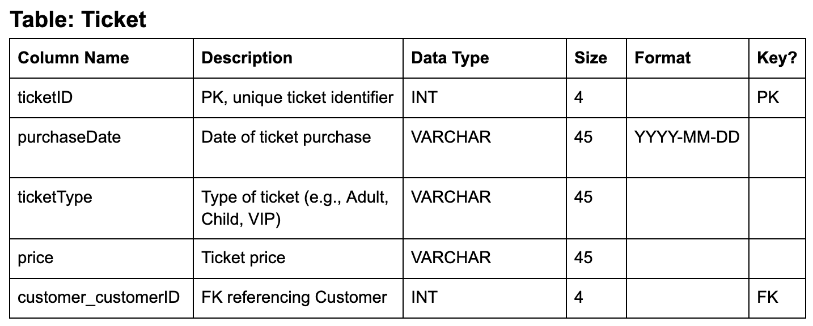
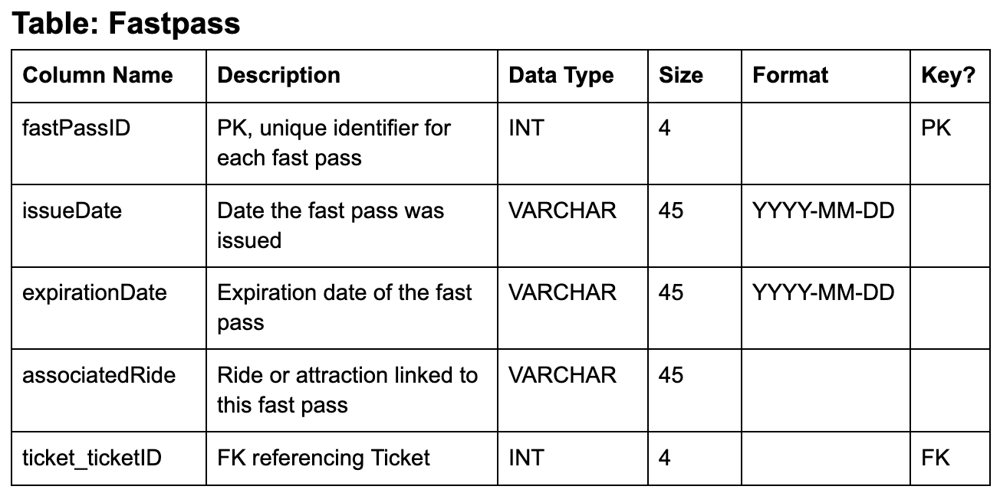
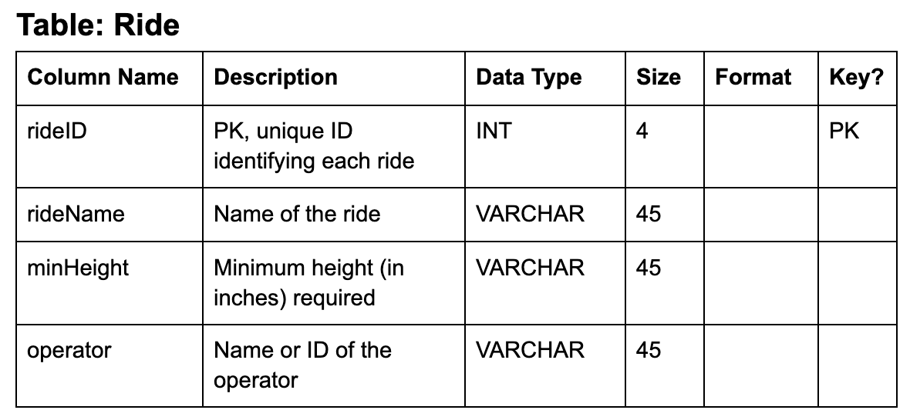 
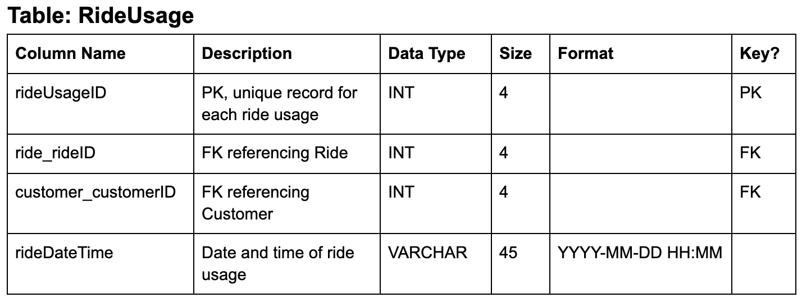
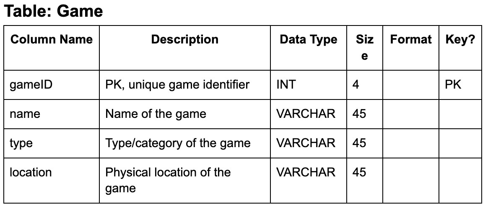
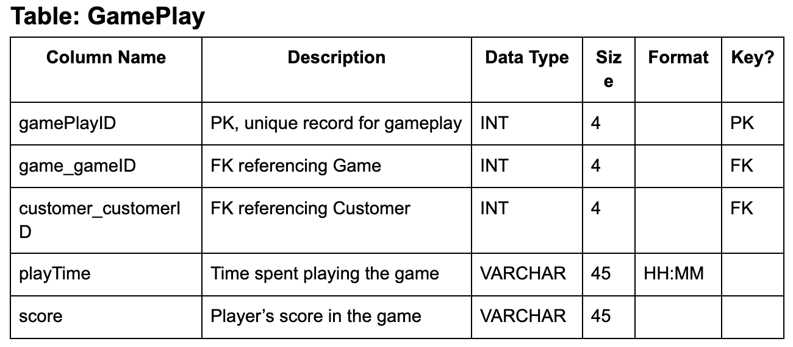
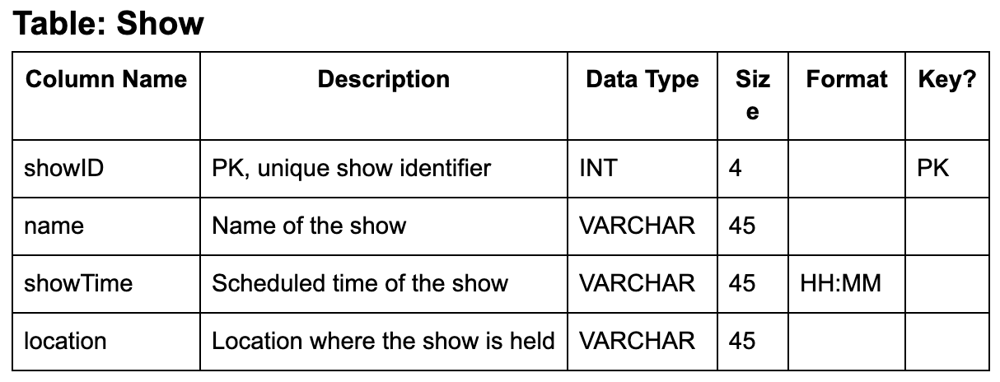
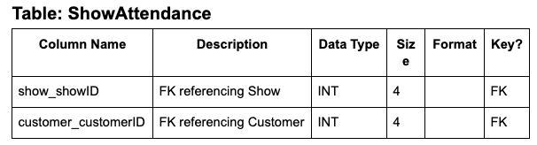
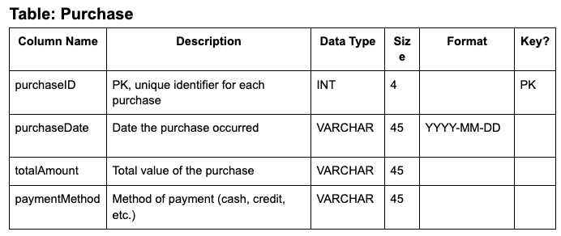
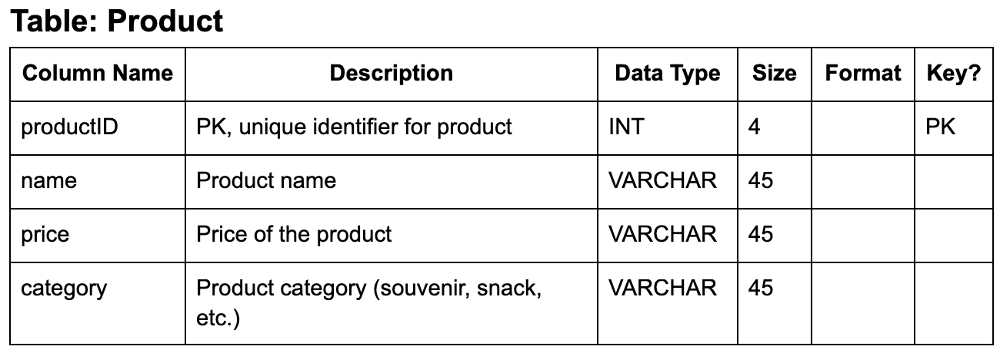
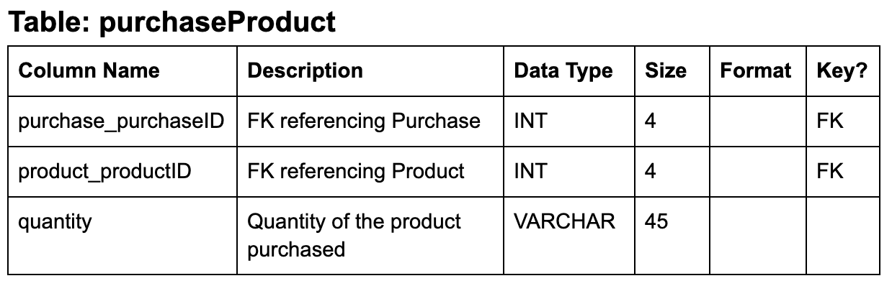
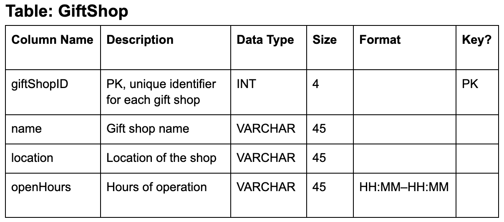
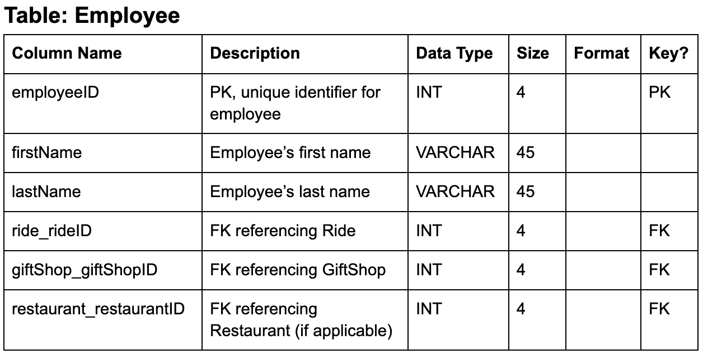
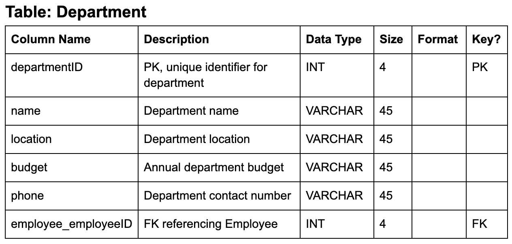

## Queries

## Database Information
