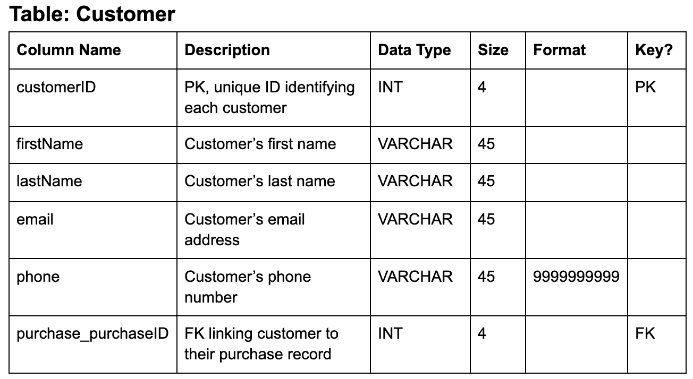

Data # Group 2 MIST 4610 Group Project 1

## Team Name
15058 Group 2 

## Team Members
- Colin Meersman cmm08294@uga.edu
- Aaron Silverman abs87438@uga.edu
- Sanjot Bodake ssb46835@uga.edu
- Divya	Kadiyala dk94810@uga.edu
- Laiba	Syed ls76725@uga.edu

## Scenario Description
A local amusement park, UGA Amusement, has asked you to design a database to manage information about its daily operations, attractions, and visitors. 

Guests who visit the park are represented as customers. For each customer, the park records a unique ID, name (first and last), email, and phone number. Customers can purchase different types of tickets (for entry) and fast passes (for skipping lines). A customer can hold many tickets or fast passes, but each ticket or pass belongs to only one customer.

Customers can attend games, shows, and ride attractions during their visit. The GamePlay tracks the score earned during the duration of each game played by a customer. The ShowAttendance tracks which customer attended which show on what date. While the RideUsage notes which rides were taken by which customer and when.

The park also has a variety of products for sale at the Gift Shop, which has its own ID, name, location, and open hours. Each product has an ID, name, category, and price. Products are linked to purchases made by customers. The Purchase stores info about the purchase ID, date, total amount, and payment method. While the purchaseProduct tracks each product purchased, along with the quantity of products included in each purchase.

UGA Amusement employs a large number of employees to manage park operations. For each employee, the database stores ID, name, role, hire date, and salary. Each employee works in one department. The departments include an ID, name, location, budget, and phone number.

## Data Model
Explanation of Data Model

Our model represents the structure of UGA Amusement and its various operations, attractions, and customer interactions.

At the center of this model is the Customer entity, which stores details such as each customer’s name, email, and phone number. Customers are involved in nearly every area of the park’s system — buying tickets, attending shows, playing games, and making purchases — so this entity serves as a hub for multiple relationships.

Each Customer can buy multiple Tickets, represented by the one-to-many relationship between the Customer and Ticket tables. The Ticket table records the ticket type, purchase date, and price. Some guests also receive Fast Passes, which allow priority access to certain rides. Because each Fast Pass corresponds to a single ticket, we have a one-to-one relationship between Ticket and Fast Pass.

Customers can also purchase products from the park’s various Gift Shops. Purchases include the purchase date, total amount, and payment method. Since a purchase can contain multiple products and each product can appear in multiple purchases, we use an associative entity called PurchaseProduct between Purchase and Product. This table includes details such as quantity to show what was bought and in what amount. The Product table itself stores product names, prices, and categories, while the Gift Shop table represents each shop’s name, location, and operating hours. A one-to-many relationship exists between Gift Shop and Product since each shop sells multiple items.

The Department and Employee entities represent the park’s internal organizational structure. Each employee works within a specific department (such as Security, Maintenance, or Guest Services), so there is a one-to-many relationship between Department and Employee. Employees are also linked to the rides or gift shops they manage or operate, connecting the operational side of the park to its attractions and retail spaces.

Attractions are represented by several entities. The Ride entity contains information about each ride’s name, type, and minimum height requirement. Customers can use rides, creating a one-to-many relationship between Ride and RideUsage, which records when a customer used a particular ride.

Entertainment within the park is captured through the Show entity, which includes each show’s name, showtime, and location. Customers attending shows are tracked through the ShowAttendance table — an associative entity that shows which customer attended which show and when.

The Game and Gameplay entities represent the park’s arcade and game activities. Each game has attributes like name, type, and location, while Gameplay tracks which customer played which game and the score they achieved. This relationship is many-to-many, implemented through the Gameplay table.

Altogether, this data model illustrates how guests interact with various aspects of the theme park — from rides, shows, and games to purchases and ticketing — while also representing how departments, employees, and retail operations support the park’s daily functions.

## Data Dictionary

## Queries

## Database Information
